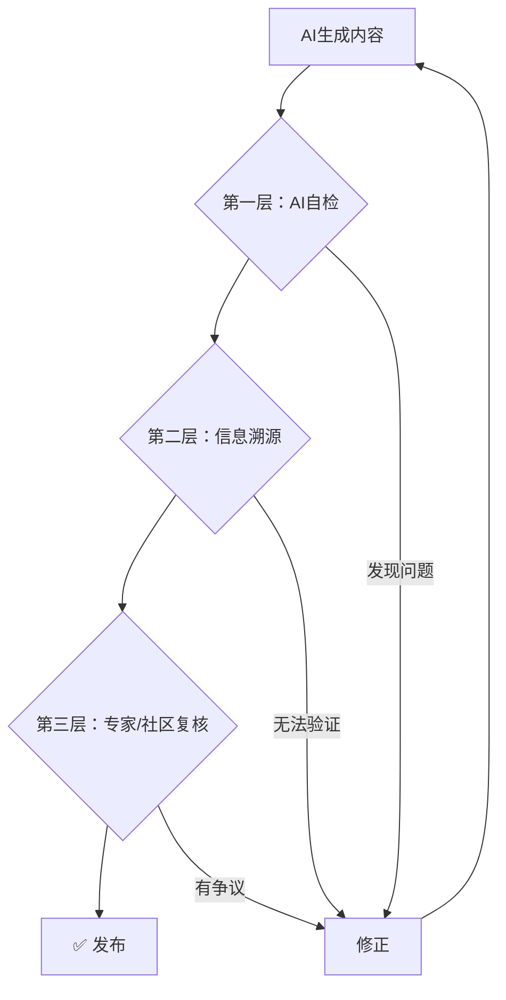

# ✅ 科普内容真实性验证工作流

> AI容易"一本正经胡说八道"，本工作流帮你建立多层防线。

---

## 🚨 为什么需要这个工作流？

AI生成内容常见问题：
- **幻觉**：编造不存在的研究、人物、数据
- **过时**：使用已被推翻的旧结论
- **简化过度**：为通俗牺牲准确性
- **张冠李戴**：混淆相似概念

---

## 🗺️ 验证流程



---

## 第一层：AI自检

### 提示词：让AI找自己的茬

```markdown
# 任务
请仔细审查以下科普内容，找出所有可能存在的事实性问题。

# 待审查内容
{{AI生成的科普文案}}

# 审查清单
请逐项检查并报告：

## 1. 数据核查
- 文中提到的所有数字/百分比/日期是否有据可查？
- 请列出每个数据及其可能的来源

## 2. 引用核查
- 提到的研究/论文/人物是否真实存在？
- 请标注每个引用的可信度：✅确认存在 / ⚠️无法确认 / ❌存疑

## 3. 逻辑核查
- 是否有因果关系推断过度？
- 是否有模糊或绝对化表述？

## 4. 时效核查
- 信息是否是最新的？
- 是否有已被推翻的旧结论？

# 输出格式
| 问题类型 | 原文位置 | 具体问题 | 建议修改 |
|---------|---------|---------|---------|
| 数据存疑 | "90%的..." | 未找到来源 | 删除或标注来源 |
| ... | ... | ... | ... |
```

---

## 第二层：信息溯源

### 可信信息源优先级

| 优先级 | 信息源类型 | 示例 |
|-------|-----------|-----|
| ⭐⭐⭐⭐⭐ | 原始论文/官方机构 | Nature, WHO, NASA官网 |
| ⭐⭐⭐⭐ | 权威科普平台 | 果壳、知识分子、科学松鼠会 |
| ⭐⭐⭐ | 高质量维基百科 | 英文维基（需看引用） |
| ⭐⭐ | 新闻报道 | 需交叉验证 |
| ⭐ | 社交媒体 | 仅作线索，不作依据 |

### 提示词：生成验证搜索词

```markdown
# 任务
为以下待验证的信息点生成有效的搜索验证策略。

# 待验证信息
{{具体信息点}}

# 输出
1. **中文搜索词**：...
2. **英文搜索词**：...
3. **学术搜索**：Google Scholar / PubMed 搜索语法
4. **推荐验证源**：最可能找到原始信息的2-3个网站
5. **红旗信号**：如果搜到以下内容说明原信息可能有误...
```

---

## 第三层：社区/专家复核

### 复核渠道

| 渠道 | 适用场景 | 响应速度 |
|-----|---------|---------|
| 知乎提问 | 通识类问题 | 1-3天 |
| 专业论坛 | 垂直领域 | 1-7天 |
| 付费咨询 | 紧急/高风险 | 即时 |
| 学术社交 | ResearchGate提问 | 1-2周 |

### 提问模板

```markdown
【事实核查求助】

我正在制作一期关于「{{主题}}」的科普内容，有以下信息点需要验证：

1. {{信息点1}}
   - 我找到的来源：{{来源}}
   - 我的疑问：{{具体疑问}}

2. {{信息点2}}
   - ...

希望得到：
- 确认这些信息是否准确
- 如有错误，正确的说法是什么
- 推荐可引用的权威来源

感谢专业人士指点！
```

---

## 📋 最终发布检查清单

```markdown
# 发布前核查表

## 基本信息
- [ ] 标题准确反映内容，无标题党
- [ ] 所有专业术语有解释或可理解

## 事实核查
- [ ] 所有数据已找到可靠来源
- [ ] 无法验证的信息已删除或标注"据称"
- [ ] 引用的研究/人物已确认存在
- [ ] 没有过度简化导致的误导

## 表述规范
- [ ] 相关性不等于因果性（已正确表述）
- [ ] 避免了"绝对""一定""100%"等表述
- [ ] 区分了"研究发现"和"科学定论"

## 时效性
- [ ] 信息截止日期已标注（如需要）
- [ ] 无使用已过时信息

## 版权合规
- [ ] 引用已注明来源
- [ ] 图片已获授权或使用AI生成/可商用素材

---
核查人：________
日期：________
```

---

## 💡 反幻觉技巧

1. **要求引用**：在prompt中要求AI给出每个事实的来源
   ```
   每个数据请在括号中标注可能的来源。
   ```

2. **自问自答**：生成完内容后让AI质疑自己
   ```
   请对上述内容提出5个最可能被专业人士挑战的问题。
   ```

3. **角色扮演**：让AI扮演怀疑论者
   ```
   假设你是一位该领域的资深审稿人，请指出上述内容的漏洞。
   ```

4. **多模型交叉**：用GPT生成，让Claude审查（或反过来）
