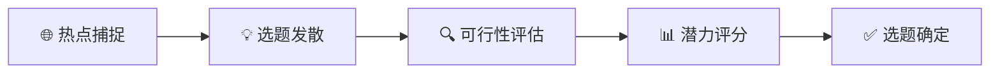

# 🎯 科普选题生成工作流

> 如何用AI快速产出高质量选题，并评估其传播潜力。

---

## 🗺️ 流程总览



---

## 阶段1️⃣：热点捕捉

### 信息源清单
| 类型 | 来源 | 适用领域 |
|-----|-----|---------|
| 学术前沿 | Nature News, Science Daily, arXiv | 硬核科研 |
| 社交热点 | 微博热搜、知乎热榜、抖音热门 | 大众关注 |
| 行业报告 | 艾瑞、麦肯锡、WHO年报 | 数据支撑 |
| 冷知识库 | Reddit TIL、Quora、果壳 | 趣味科普 |

### 提示词：热点关联

```markdown
# 角色
你是一位拥有5年经验的科普自媒体运营总监。

# 任务
以下是今日热点事件，请为每个热点生成3个有深度的科普角度。

# 热点事件
{{列出2-3个当日热点}}

# 输出格式
## 热点1：{{热点标题}}
1. **科普角度A**：[标题] - [一句话解释为什么这个角度有传播力]
2. **科普角度B**：...
3. **科普角度C**：...

## 热点2：...

# 要求
- 角度要有"反常识"或"解谜"的特质
- 避免太专业导致受众过窄
- 优先选择有视觉表现力的角度
```

---

## 阶段2️⃣：选题发散

### 提示词：创意发散

```markdown
# 角色
你是一个头脑风暴专家，擅长从一个主题发散出无数创意。

# 任务
围绕主题「{{主题关键词}}」，使用以下框架生成选题创意：

## 发散框架
1. **5W1H发散**
   - Why：为什么会这样？
   - What：这是什么原理？
   - How：这是怎么做到的？
   - When：什么时候发现/发生的？
   - Where：哪里能看到/应用？
   - Who：谁发明/发现的？

2. **对比发散**
   - 古今对比
   - 中外对比
   - 理想vs现实
   - 科幻vs科学

3. **场景发散**
   - 日常生活场景
   - 极端环境场景
   - 未来场景

# 输出
为每个框架维度生成2个选题创意。
格式：[选题标题] - [目标受众] - [核心看点]
```

---

## 阶段3️⃣：可行性评估

### 提示词：选题评估

```markdown
# 任务
评估以下科普选题的可行性。

# 选题
{{选题标题和简述}}

# 评估维度（请逐项打分1-5并说明理由）

| 维度 | 评分 | 理由 |
|-----|-----|-----|
| 📚 信息可获取性 | ?/5 | 是否能找到可靠信息源？ |
| 🎨 视觉表现力 | ?/5 | 能否生成吸引人的画面？ |
| 👥 受众覆盖面 | ?/5 | 目标受众有多大？ |
| 🔥 话题热度 | ?/5 | 当前是否有讨论度？ |
| ⚡️ 制作难度 | ?/5 | 需要多少时间/资源？ |
| 🎯 差异化程度 | ?/5 | 竞品是否已经做过？ |

## 总分：?/30
## 综合建议：推荐 / 考虑 / 不推荐
## 优化建议：...
```

---

## 阶段4️⃣：标题优化

### 提示词：爆款标题生成

```markdown
# 任务
为以下科普选题生成10个爆款标题。

# 选题
{{确定的选题}}

# 标题公式参考
1. 提问式：「为什么...？」
2. 数字式：「99%的人不知道的X个...」
3. 反常识：「原来...才是真相」
4. 对比式：「A vs B，结果令人震惊」
5. 揭秘式：「...的真相终于曝光了」
6. 故事式：「他用...改变了...」
7. 恐惧式：「你每天都在...却不知道...」
8. 好奇式：「当...会发生什么？」

# 要求
- 标题15字以内（适配手机屏幕）
- 避免低俗/哗众取宠
- 保持信息准确性
- 为每个标题注明使用的公式类型
```

---

## 💡 选题黄金法则

1. **3秒法则**：选题能否在3秒内说清楚？
2. **妈妈测试**：你妈妈会对这个感兴趣吗？
3. **咖啡馆测试**：这个话题能在咖啡馆引发讨论吗？
4. **搜索测试**：这个问题真的有人在搜吗？

---

## 📋 选题决策模板

```markdown
# 选题决策记录

## 日期：{{date}}
## 候选选题池
1. ...
2. ...
3. ...

## 最终选定：{{选题}}
## 选定理由：{{为什么选这个}}
## 目标平台：{{B站/抖音/小红书/公众号}}
## 预计时长：{{X分钟}}
## 制作周期：{{X天}}
```
